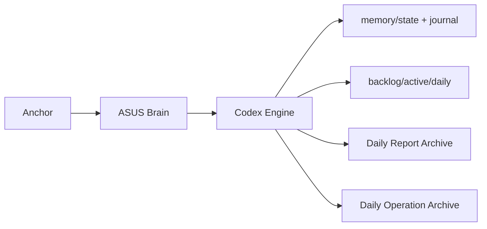

# ASUS DAILY REPORT

Date: 2026-03-01
Day: Sunday
Time: 04:14:09
Generated UTC: 2026-03-01T10:14:09Z
Node: t79
Mode: Development

## Professional Language (Executive Summary)
System remained in monitored deterministic mode. Archive was generated with operational snapshot, task summary, and risk posture. Current risk level: **LOW**.

## Engineering Language (Technical Summary)
- Kernel: 6.14.0-37-generic
- Uptime: up 9 hours, 48 minutes
- LoadAvg: 0.09 0.14 0.17 1/1198 50345
- Node: v20.20.0
- Memory Used: 24%
- Disk Used (/): 5%
- UFW: active
- SSH: active(socket)
- Backlog items: 0
- Active task: none (IDLE)
- Journal events today (UTC): 25

## Commercial Language (Business Readout)
Operational continuity is stable with documented daily evidence. Risk exposure status: **LOW**. This supports controlled progress toward production-grade governance and audit readiness.

## Achievements (Today)
- Daily archive generated automatically.
- Operational metrics captured.
- Task state and journal activity captured.

## Risks / Damage Watch
No immediate risk detected.

## Diagram (Mermaid)


## Raw Health Payload
```json
{"status":"alive","utc":"2026-03-01T10:14:09.451Z"}
```
